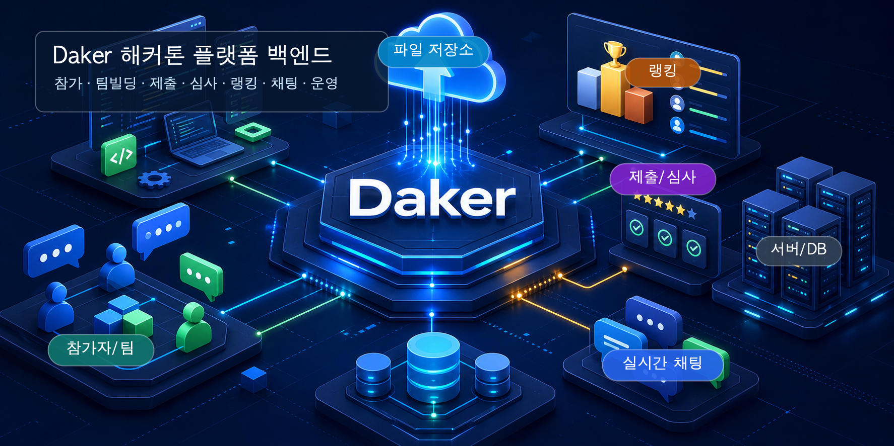
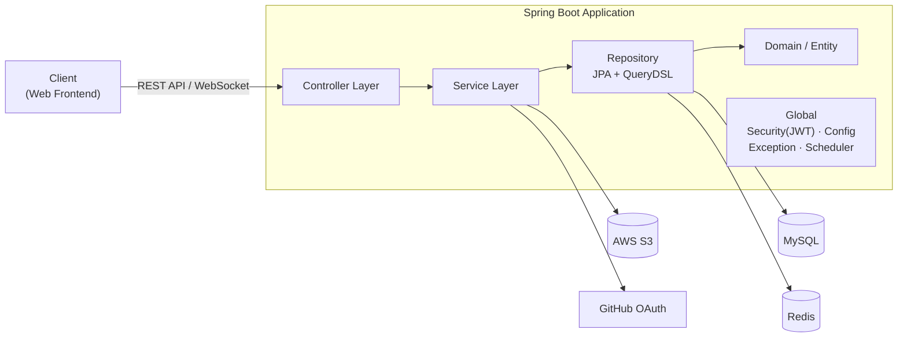
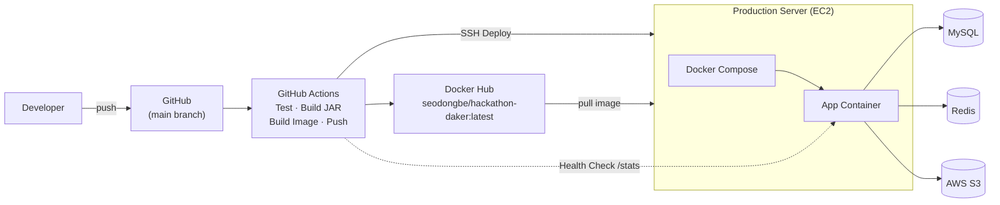

<p align="center">
  
</p>

<p align="center">
  
  
  
  
  
  
</p>

> 해커톤을 **개최하고, 참가하고, 심사하고, 경쟁하는** 모든 과정을 담은 해커톤 플랫폼 백엔드 서버입니다.

Daker-server는 해커톤 주최자, 참가자, 심사위원, 관리자가 사용하는 핵심 기능을 제공하는 Spring Boot 기반 REST API + 실시간 채팅 서버입니다. 해커톤 등록부터 팀 빌딩, 결과물 제출, 심사, 랭킹, 관리자 운영까지 하나의 흐름으로 처리합니다.

<br/>

## 목차

- [기술 스택](#기술-스택)
- [주요 기능](#주요-기능)
- [시스템 아키텍처](#시스템-아키텍처)
- [배포 아키텍처](#배포-아키텍처)
- [주요 구현 내용](#주요-구현-내용)
- [API 문서](#api-문서)
- [시작하기](#시작하기)
- [환경 변수](#환경-변수)
- [CI/CD](#cicd)
- [프로젝트 구조](#프로젝트-구조)

<br/>

## 기술 스택

| 분류 | 기술 |
|---|---|
| 언어 | Java 21 |
| 프레임워크 | Spring Boot 3.4.1, Spring Web, Spring Security, Spring Validation |
| 데이터 접근 | Spring Data JPA, QueryDSL 5.1.0, MySQL 8.0 |
| 인증 | JWT(jjwt 0.12.5), GitHub OAuth |
| 실시간 통신 | WebSocket, STOMP |
| 인프라 | Redis 7.2, AWS S3, Docker, Docker Compose |
| API 문서 | Springdoc OpenAPI, Swagger UI |
| 테스트 | JUnit 5, Spring Boot Test, Spring Security Test, H2 |
| CI/CD | GitHub Actions, Docker Hub, SSH Deploy |

<br/>

## 주요 기능

| 도메인 | 설명 |
|---|---|
| **인증 (Auth)** | 이메일 회원가입·로그인, JWT 액세스/리프레시 토큰, GitHub OAuth 소셜 로그인 |
| **유저 (User)** | 관심 태그 등록·관리, 태그 기반 추천 해커톤 제공 |
| **해커톤 (Hackathon)** | 해커톤 목록·상세 조회, 참가 등록, 리더보드, 결과물 제출·이력 관리 |
| **팀 (Team)** | 팀 생성·수정·삭제, 팀원 모집 공고 및 지원/수락/거절 |
| **심사 (Judge)** | 심사위원 전용 해커톤·팀 조회, 평가 점수 등록 |
| **투표 (Vote)** | 심사위원 권한 기반 해커톤 투표 |
| **랭킹 (Ranking)** | XP 기반 전체 랭킹, 참여 랭킹, 내 랭킹 조회 |
| **채팅 (Chat)** | 해커톤별 실시간 채팅방(WebSocket / STOMP) |
| **통계 (Stats)** | 플랫폼 활동 통계 집계 |
| **관리자 (Admin)** | 대시보드, 해커톤·유저·심사위원·제출물 관리, 제출물 일괄 다운로드 |

<br/>

## 시스템 아키텍처



도메인별로 패키지를 분리하고, 각 도메인은 `controller -> service -> repository -> domain` 계층 구조를 따릅니다. 공통 관심사는 `global` 패키지에 모아 인증, 설정, 예외 처리, 공통 응답, 외부 인프라 연동을 담당합니다.

<br/>

## 배포 아키텍처



`main` 브랜치에 변경 사항이 반영되면 GitHub Actions가 JAR를 빌드하고 Docker 이미지를 생성해 Docker Hub에 푸시합니다. 이후 운영 서버에 SSH로 접속해 최신 이미지를 pull하고 `docker-compose.prod.yml` 기준으로 애플리케이션 컨테이너를 재기동합니다.

| 구성요소 | 역할 |
|---|---|
| GitHub Actions | CI 테스트, JAR 빌드, Docker 이미지 빌드·푸시, 운영 서버 배포 |
| Docker Hub | `seodongbe/hackathon-daker:latest` 이미지 저장소 |
| 운영 서버 | Docker Compose 기반 Spring Boot 애플리케이션 실행 |
| MySQL | 서비스 주요 영속 데이터 저장 |
| Redis | 토큰·캐싱 등 휘발성 데이터 저장 |
| AWS S3 | 해커톤 제출 파일 저장 |
| 헬스 체크 | 배포 후 `http://{EC2_HOST}:8080/stats` 응답 확인 |

자세한 배포 설정은 [`DEPLOYMENT.md`](./DEPLOYMENT.md), 필요한 시크릿 예시는 [`GITHUB_SECRETS.example.md`](./GITHUB_SECRETS.example.md)를 참고합니다.

<br/>

## 주요 구현 내용

- **JWT + GitHub OAuth 인증**: 액세스 토큰(1시간)과 리프레시 토큰(14일)을 사용하며, GitHub OAuth 소셜 로그인을 함께 지원합니다.
- **역할 기반 접근 제어**: Spring Security 필터 체인에서 토큰을 검증하고 관리자·심사위원 권한별 API 접근을 제어합니다.
- **QueryDSL 동적 조회**: 해커톤, 팀, 랭킹 목록에서 필터·정렬 조건을 타입 안전하게 처리합니다.
- **실시간 채팅**: STOMP over WebSocket(`/ws/chat`) 기반으로 해커톤별 채팅방을 운영합니다.
- **파일 업로드**: 해커톤 결과물 제출 시 멀티파트 파일을 AWS S3에 저장하며, 최대 50MB까지 허용합니다.
- **해커톤 상태 자동 전환**: 스케줄러가 일정에 따라 해커톤 상태를 자동으로 갱신합니다.
- **XP & 랭킹 시스템**: 유저 활동에 따른 XP 이력을 기록하고 전체·참여·개인 랭킹을 제공합니다.
- **관리자 운영 기능**: 해커톤 생성/수정/종료, 심사위원 배정, 제출물 조회·다운로드, 유저 관리 기능을 제공합니다.
- **공통 응답·예외 처리**: `ApiResponse`, `PageResponse`, `GlobalExceptionHandler`, `ErrorCode`로 응답과 예외 형식을 통일합니다.

<br/>

## API 문서

애플리케이션 실행 후 Swagger UI에서 전체 API 명세를 확인할 수 있습니다.

- Swagger UI: `http://localhost:8080/swagger-ui.html`
- OpenAPI Spec: `http://localhost:8080/v3/api-docs`

<br/>

## 시작하기

### 요구 사항

- JDK 21
- Docker / Docker Compose

### 1. 인프라 실행

```bash
docker compose up -d
```

- MySQL: `localhost:3307` (DB: `daker`)
- Redis: `localhost:6380`

### 2. 환경 변수 설정

`local` 프로필은 MySQL과 Redis를 Docker Compose 설정으로 사용합니다. 애플리케이션 시작 시 S3 클라이언트가 생성되므로 `AWS_ACCESS_KEY`, `AWS_SECRET_KEY`는 로컬에서도 주입해야 합니다. 실제 파일 업로드를 테스트하지 않는 경우에는 개발용 더미 값을 사용할 수 있습니다.

### 3. 빌드 및 실행

```bash
./gradlew clean build
./gradlew bootRun
```

서버는 `http://localhost:8080`에서 동작합니다.

### 테스트

```bash
./gradlew test
```

테스트는 H2 인메모리 DB 기반으로 실행됩니다.

<br/>

## 환경 변수

`SPRING_PROFILES_ACTIVE` 값으로 프로필을 전환합니다. 기본 프로필은 `local`입니다.

| 변수 | 설명 | 사용 프로필 |
|---|---|---|
| `SPRING_PROFILES_ACTIVE` | 활성 프로필(`local`, `prod`) | 공통 |
| `FRONTEND_URL` | 프론트엔드 주소 | 공통 |
| `JWT_SECRET` | JWT 서명 시크릿 키 | prod |
| `DB_URL` / `DB_USERNAME` / `DB_PASSWORD` | MySQL 접속 정보 | prod |
| `REDIS_HOST` / `REDIS_PORT` | Redis 접속 정보 | prod |
| `GITHUB_CLIENT_ID` / `GITHUB_CLIENT_SECRET` / `GITHUB_REDIRECT_URI` | GitHub OAuth 설정 | 공통 |
| `AWS_ACCESS_KEY` / `AWS_SECRET_KEY` | AWS 자격 증명 | 공통 |
| `AWS_REGION` | AWS 리전 | prod |
| `AWS_S3_BUCKET` / `AWS_S3_FOLDER` | S3 버킷·폴더 | prod |

<br/>

## CI/CD

- **CI**: `main` 브랜치로 향하는 Pull Request와 `main` push에서 `./gradlew test`를 실행합니다.
- **CD**: `main` push 또는 수동 실행(`workflow_dispatch`) 시 JAR 빌드, Docker 이미지 빌드·푸시, 운영 서버 배포를 수행합니다.
- **배포 방식**: GitHub Actions -> Docker Hub -> 운영 서버 SSH -> Docker Compose 재기동
- **배포 이미지**: `seodongbe/hackathon-daker:latest`

<br/>

## 프로젝트 구조

```text
src/main/java/com/daker
├── DakerApplication.java
├── domain
│   ├── admin          # 관리자 대시보드, 해커톤·유저·심사위원·제출물 관리
│   ├── auth           # 인증·인가, JWT, GitHub OAuth
│   ├── chat           # WebSocket 채팅
│   ├── hackathon      # 해커톤, 등록, 마일스톤, 상금, 심사 기준
│   ├── judge          # 심사 평가
│   ├── ranking        # 랭킹
│   ├── stats          # 통계
│   ├── submission     # 결과물 제출
│   ├── team           # 팀, 팀원, 모집 지원
│   ├── user           # 사용자, 관심 태그
│   ├── vote           # 투표
│   └── xp             # XP 이력
└── global
    ├── auth           # JWT 필터·토큰 처리
    ├── config         # Security, WebSocket, Redis, S3, Swagger, QueryDSL
    ├── exception      # 전역 예외 처리
    ├── infra          # S3 업로더 등 외부 연동
    ├── response       # 공통 응답 포맷
    └── scheduler      # 해커톤 상태 자동 전환 스케줄러
```
